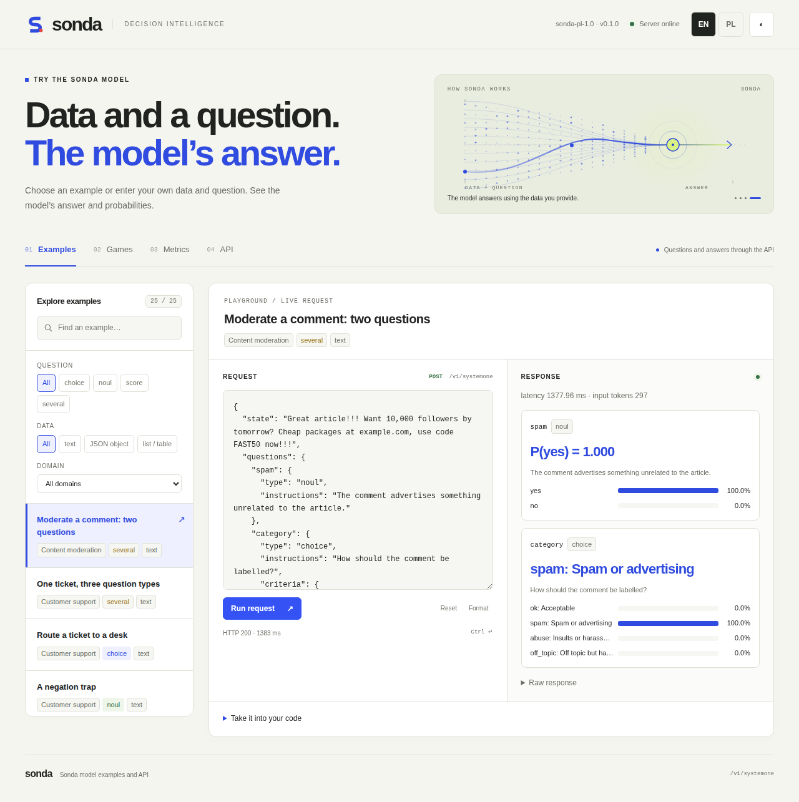
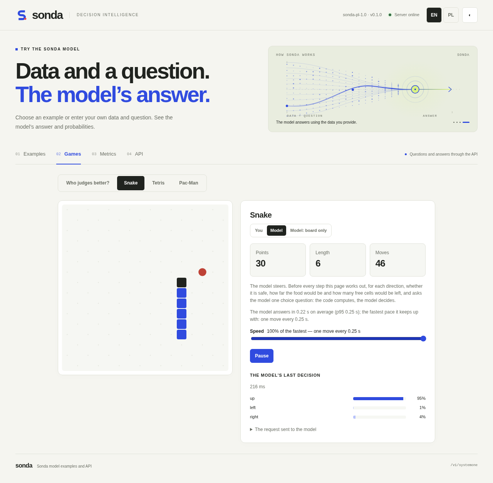
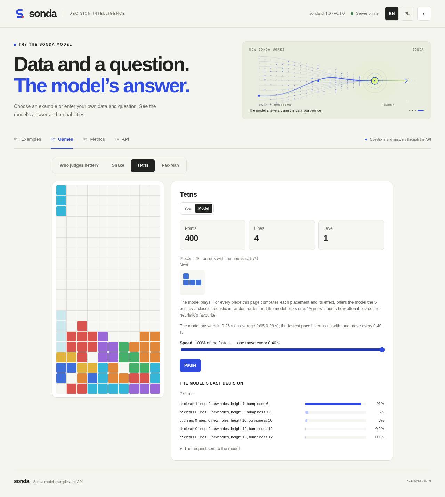
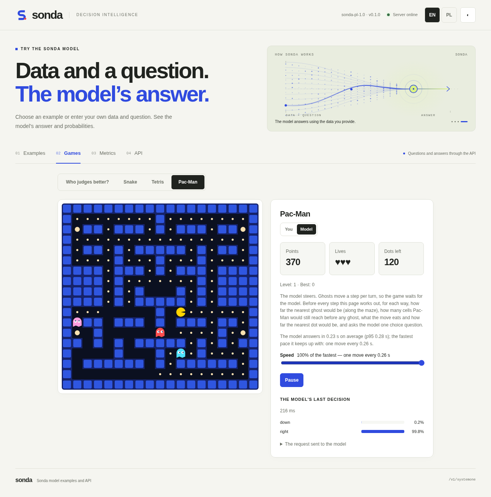
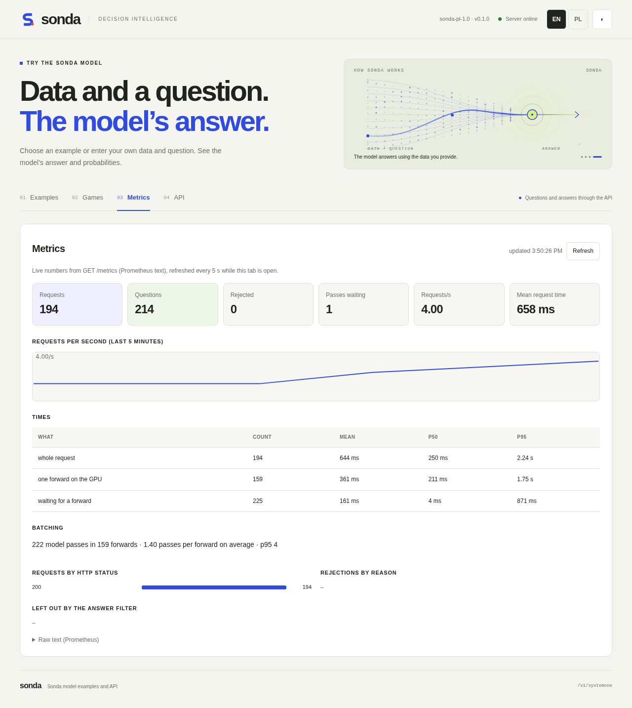
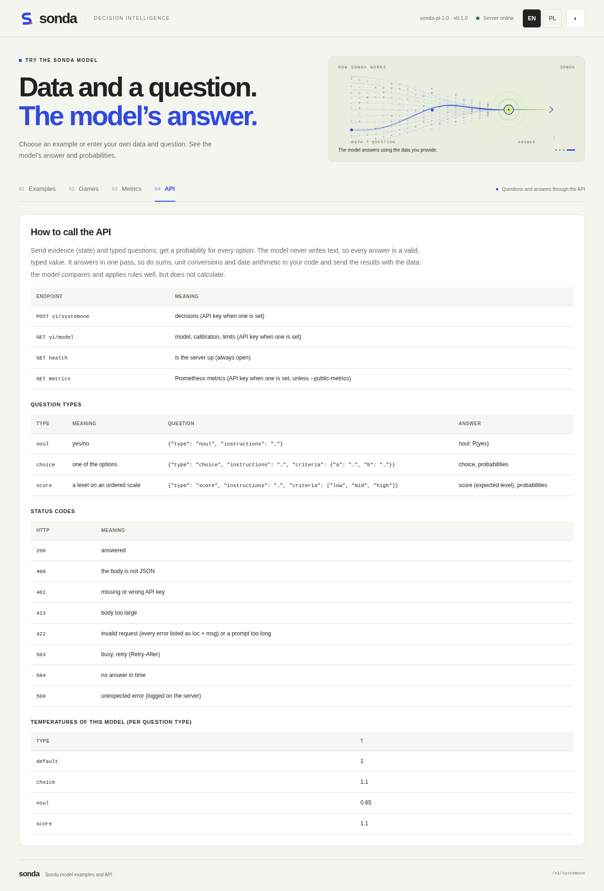

# sonda-server


A `/v1/systemone` decision server for sonda models: models that answer typed questions — yes/no, choice, score —
about a piece of evidence in one forward pass, with calibrated probabilities.

* **many clients at once:** an async HTTP server and dynamic batching — prompts from all concurrent requests
  share forwards on the GPU instead of waiting in line one by one;
* **request validation:** a closed schema and limits; an invalid request is rejected whole with every error
  and its location, before the model sees it;
* **answer filtering:** every answer field is checked; invalid fields are dropped without an error, an answer
  without a valid core is listed in `omitted`;
* **temperature per question type** from the model's `sonda.conf`, reloadable without a restart;
* a page at `/` with API examples in English and Polish (filtered by question type, kind of data and domain,
  each with `curl`, Python and JavaScript code), live metrics, and games: a calibration game against the model, and
  Snake, Tetris and Pac-Man played by you or steered by the model through the API;
* metrics, an optional API key (with a key set, the API, model info and metrics need it), a Host allow-list and a
  refusal of POSTs from other web pages; startup switches to turn validation off;
* the TypeSafe-style `/v1/systemone` API, and a prompt token-identical to the one the models were trained on
  (checked against recorded reference outputs).


## Installation

**Requirements:** Linux with an NVIDIA GPU and CUDA, Python 3.11 or newer, and about 10 GB of GPU memory for a 4B
model in bf16 (about 9 GB of weights plus the activations of each forward).

```bash
git clone <repository-url> sonda
cd sonda
python -m venv .venv
.venv/bin/pip install -e ".[gpu]"     # the server, PyTorch and transformers (>= 5.0, which loads Qwen3.5)
.venv/bin/sonda-server --version      # sonda-server 0.1.0
```

**Already have a CUDA build of PyTorch** (an NVIDIA container, or an ARM machine such as the GB10 where pip may not
find a matching build)? Install without the extra, so that build is kept:

```bash
.venv/bin/pip install -e .            # fastapi, uvicorn, orjson, pydantic, numpy only
```

To reuse PyTorch and transformers from another virtual environment instead, see
[docs/OPERATIONS.md](docs/OPERATIONS.md#environment).

**A model:** sonda-server serves a local model folder holding the weights (`model.safetensors`), the tokenizer and,
optionally, the calibration `sonda.conf`. To fetch one from Hugging Face:

```bash
huggingface-cli download <model-repo> --local-dir models/<model-name>
```


## Quick start

```bash
sonda-server --model /path/to/model --port 8090

curl -s localhost:8090/v1/systemone -d '{
  "state": "Order 7120 was delivered 12 days ago; the customer asks for a refund.",
  "questions": {"refund": {"type": "noul", "instructions": "Is a refund allowed under the 30-day policy?"}}}'
```

Then open http://localhost:8090/ for examples to edit and send, and the game.

## Screenshots

The page at `/`, served by sonda-server with a 4B Polish/English decision model on one GPU.


**Examples** — edit a request, send it, and see every answer as probabilities, with the same request as `curl`,
Python and JavaScript code:



**Games steered by the model** — before every move the page computes what each move would do, and the model picks
one with a single `choice` question; the panel shows its last decision and the pace it keeps up with.

<table>
<tr><th>Snake</th><th>Tetris</th><th>Pac-Man</th></tr>
<tr>
<td valign="top" width="33%"><a href="docs/screenshots/game-snake.png"></a></td>
<td valign="top" width="33%"><a href="docs/screenshots/game-tetris.png"></a></td>
<td valign="top" width="33%"><a href="docs/screenshots/game-pacman.png"></a></td>
</tr>
</table>

**Metrics** — live numbers from `GET /metrics` (here with four clients sending requests) — and the **API** reference:

<table>
<tr><th>Metrics</th><th>API</th></tr>
<tr>
<td valign="top" width="50%"><a href="docs/screenshots/metrics.png"></a></td>
<td valign="top" width="50%"><a href="docs/screenshots/api.png"></a></td>
</tr>
</table>

## Documentation

* [docs/API.md](docs/API.md) — requests, answers, status codes, endpoints
* [docs/ARCHITECTURE.md](docs/ARCHITECTURE.md) — prompt, readout, temperatures, many options, batching
* [docs/OPERATIONS.md](docs/OPERATIONS.md) — installation, options, recalibration, tuning, memory

## License

Apache License 2.0 (LICENSE). Parts of the decision runtime are adapted from third-party work; see NOTICE.

## Acknowledgements

Inspired by [JevK5](https://github.com/allebee/jevk5); parts of the decision runtime are adapted from JevK5
(Apache-2.0), which adapts [SemIf](https://github.com/TheoLeeCJ/SemIf) (MIT). Models built on JevK5 and
[Qwen3.5-4B](https://huggingface.co/Qwen/Qwen3.5-4B) (Apache-2.0). Independent project, not affiliated with
TypeSafe AI, the JevK5 authors or the Qwen team.
